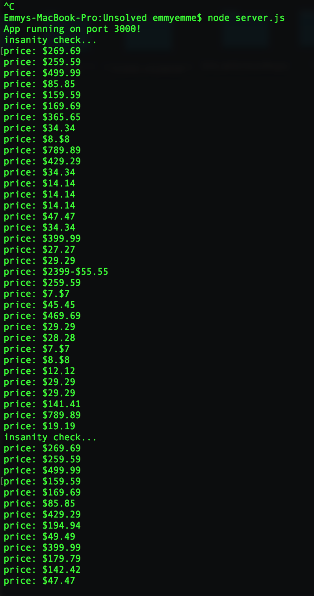

# Amazon-Scrape

This server script tests the feasibility of scraping a large and complex ecommerce site such as Amazon, and the security obstacles that may arise. 

First, create a GET route that queries the Amazon website for 'couches'. 

Then, using cheerio NPM logic, scrape for 'prices' and 'ratings'.

Check the command line for data. 

Run in the browser and view parsed data. 

Ensure that data is written into a mongo db collection via the configuration URL. 

Although I was able to scrape a results column from Amazon's source code into my local mongdo db collection, the script only worked successfully and consistently during the first few tests. In this case, a runtime 'success' means the data displays on both the browser as well as the CLI. A 'failure' means there is an empty array. Note that after the first run, I commented out the db insert so that data woud not duplicate. 

After a time lapse of about 24 hrs, the script worked about ten percent of the time, with no apparent consistency of success or failure during attempts to scrape. This suggests that Amazon's security bot may be triggered by the processing of multiple GET requests that contain scraping tools, originating from the same IP. The bot potentially shuts down the connection to avoid any type of unauthorized penetration. 
